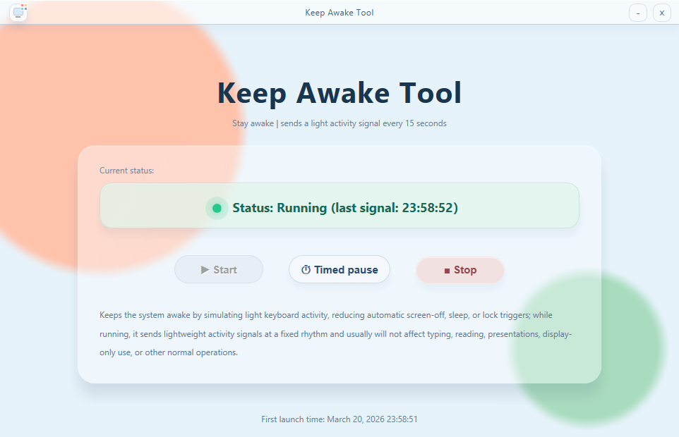

# Keep Awake Tool

A lightweight Windows keep-awake utility built with HTA 🛠️, designed to help prevent automatic screen sleep, idle display-off behavior, or lock triggers by sending periodic lightweight activity signals.

It features a polished glass-style UI ✨, timed pause options, and a simple portable workflow with no installer required.

## Features 🚀

- Prevents the system from automatically sleeping, locking, or turning off the display
- Sends lightweight activity signals at a fixed interval while running
- Start / Stop controls with clear status feedback
- Timed pause menu:
  - Pause at 11:00
  - Pause after 30 minutes
  - Pause after 1 hour
  - Pause at a custom time in `HH:MM` format
- Minimize button
- Lightweight single-file HTA app
- Portable usage with no installation required
- Local interface only, with no network usage

## How It Works ⚙️

When running, the tool periodically sends a small synthetic activity signal so Windows continues to treat the session as active.

This helps reduce unwanted:
- display sleep
- automatic lock
- idle timeout behavior

In most normal cases, it should not interfere with reading, presenting, light office work, monitoring, or other common desktop activity.

## System Requirements 💻

- Windows 10 or Windows 11 recommended
- HTA support enabled (`mshta.exe` available)
- Desktop environment with permission to run local HTA files

Older Windows versions may work, but they were not the main target.

## Startup on Windows 🔁

If you want the tool to launch automatically when you sign in:

1. Press `Win + R`
2. Type `shell:startup`
3. Press Enter
4. Copy this `.hta` file, or a shortcut to it, into that folder

After that, the tool will start automatically for your user account when Windows starts.

## Notes ⚠️

- This tool is intended as a personal utility for preventing unwanted screen sleep or lock.
- It does **not** bypass security policy, account policy, or administrator restrictions.
- It should be used only where permitted by your device or organization policy.
- On some systems, the taskbar icon shown by HTA may vary depending on Windows version and icon handling.
- HTA uses an older Windows host environment, so visual behavior may differ slightly across systems.

## Safety and Responsible Use 🔒

This tool is a neutral utility intended for local convenience and screen-awake scenarios such as reading, presenting, monitoring, or preventing unwanted idle sleep.

Users are responsible for making sure their use complies with:
- workplace policy
- IT policy
- device policy
- local rules or requirements

## Download and Use 🌍

Choose the file that matches your preferred language, then download and run it directly.

| File Name                   | Language |
| --------------------------- | -------- |
| `Keep Awake Tool zh-cn.hta` | Chinese  |
| `Keep Awake Tool en-us.hta` | English  |
| `Keep Awake Tool de-de.hta` | German   |
| `Keep Awake Tool ja-jp.hta` | Japanese |
| `Keep Awake Tool ko-kr.hta` | Korean   |

## How to Download and Run 📂

1. Download the file for your preferred language.
2. Double-click the `.hta` file to launch it.
3. If Windows shows a warning, confirm that you want to open the file.
4. Keep the file in a stable folder if you plan to create a shortcut or add it to startup.